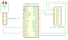
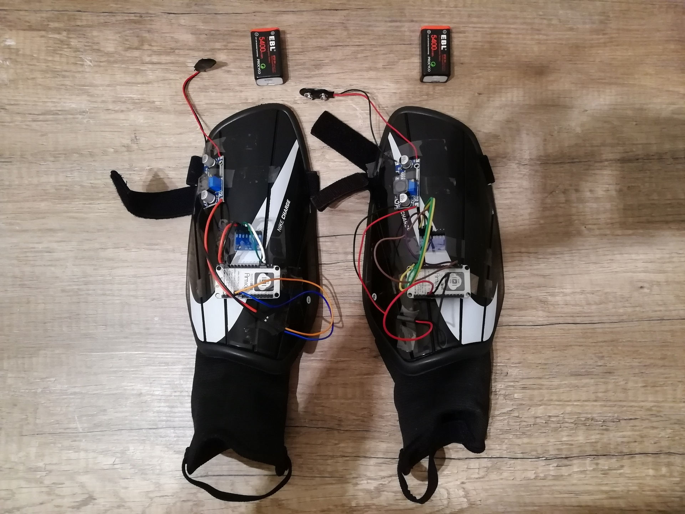
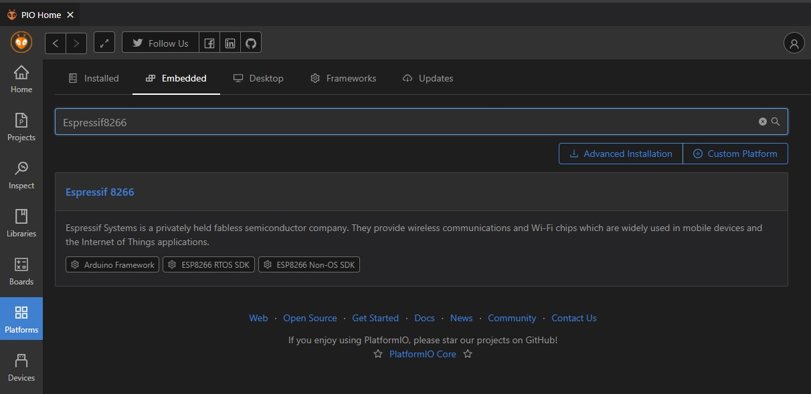
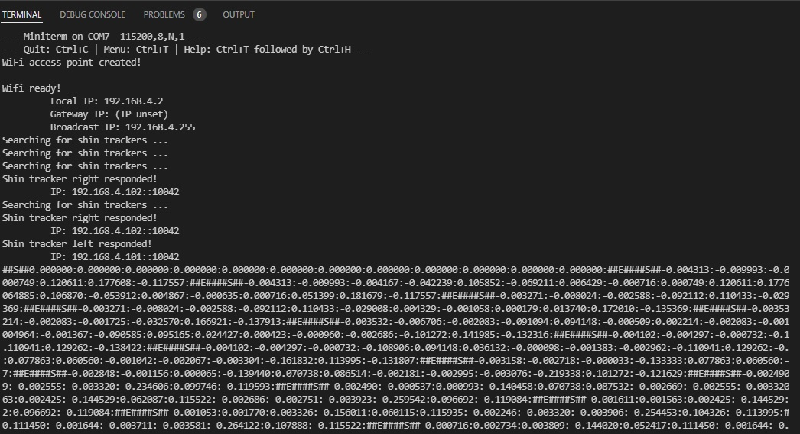

# Dual-IMU-WIP

This is the repository of the Dual Inertial-Measurement-Unit Walk-in-Place Locomotion Interface and it will show you how to build and use it. In its current form it can track the movement of the left and right leg of the user in six axis and provides the data through UDP over WiFi, or UART over USB using an Adapter. 

Our device can be used for hands free movements in virtual environments. 

## Building the Shin Trackers
The shin trackers use an inertial measurement unit each to track the movement of the leg. To build them as physical devices you will need breakout boards that feature the following items:
- ESP8266 Microcontroller
- MPU-6050 Six-Axis Gyro and Accelerometer
- Power Supply
    1. option is a 9V battery and a DC-DC buck converter (recommended)
    2. option is a power bank (may be too bulky)
- Soldering equipment and some wires
- shin guards to mount the breakout boards

We tested it with the following items:
- NodeMCU Lua Amica V2 ESP8266 ESP-12F Development Board with CP2102
- GY-521 MPU-6050 3-Axis-Gyroscope and Accelerometer
- LM2596S DC-DC step down module and rechargeable 9V batteries
- Nike Charge Shin Guards (size L)

We used soldering as well as crimping to establish the connections. Connect the pins as shown in the following schematics: 

Wiring schematics. 

Finally you can mount the components on the shin guards. The placement of the IMU is important. We placed it so x-axis is facing downwards, y-axis to the right, and z-axis forward. Place the over components wherever feasible. Make sure you still have access to the USB-port of the microcontroller to upload the software.

Here is an example of how our prototype looks like.

## Building the Software
Our software uses the Arduino framework so it is easy to understand and extensible. To build and upload the software to the microcontroller we use *Visual Studio Code* and the *PlattformIO IDE* plugin. After installing *PlatformIO IDE* you will have to install the *Espressif 8266* platform.

    
     
    You can find the required platform using the PIO menu.

The **main.cpp** contains a few defines to switch which device is to be build. Connect the respective device, uncomment the respective define, and click on *PlatformIO: build* and then *PlatformIO: upload*. Both can be found in the bottom line of Visual Studio Code. 

## Building the Adapter
In case connecting to a local WiFi is not feasible we recommend using n Adapter that locally creates a WiFi connection and provides the data via UART over USB.
To build the Adapter you simply need another ESP8266 and a USB cable. Activate the respective define in **main.cpp** and make sure that all both shin trackers use the same WiFi and port definitions as the adapter.

## How to Test
To test that everything works properly build the left and right shin tracker as well as the adapter. Power up both shin trackers and connect the Adapter to your computer and activate the serial port. You should read an output similar to this:

    

The Adapter will provide the shin tracker's data as a string in the following format: 
##S##accel_left_x:accel_left_y:accel_left_z:gyro_left_x:gyro_left_y:gyro_left_z:accel_right_x:accel_right_y:accel_right_z:gyro_right_x:gyro_right_y:gyro_right_z##E##

## Reference
    T. Uhlmann and G. Brunnett, "Dual-IMU-WIP: An easy-to-build Walk-in-Place System based on Inertial Measurement Units", 2022 IEEE 9th International Conference on Computational Intelligence and Virtual Environments for Measurement Systems and Applications (CIVEMSA), Chemnitz, Germany, 2022, pp. 1-5, doi: 10.1109/CIVEMSA53371.2022.9853693.

### Bibtex
    @INPROCEEDINGS{DualIMUWIP,
        author={Uhlmann, Tom and Brunnett, Guido},
        booktitle={2022 IEEE 9th International Conference on Computational Intelligence and Virtual Environments for Measurement Systems and Applications (CIVEMSA)}, 
        title={Dual-IMU-WIP: An easy-to-build Walk-in-Place System based on Inertial Measurement Units}, 
        year={2022},
        pages={1-5},
        doi={10.1109/CIVEMSA53371.2022.9853693}
    }
